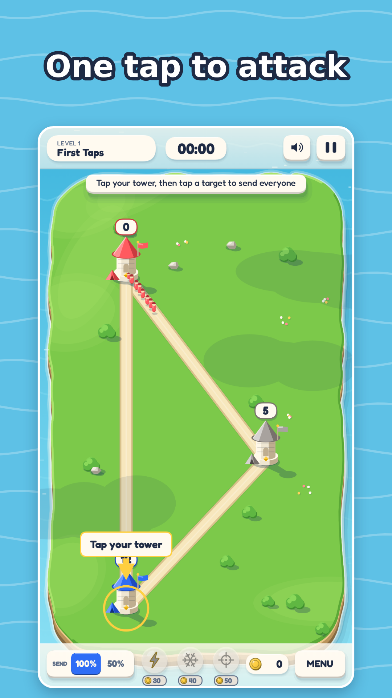
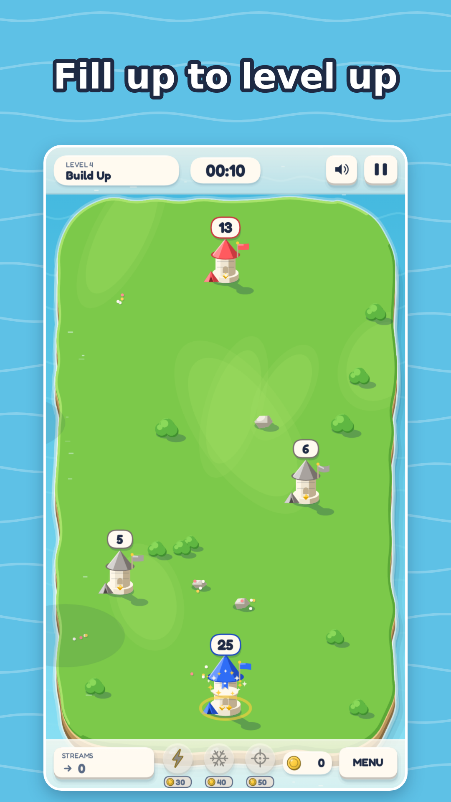
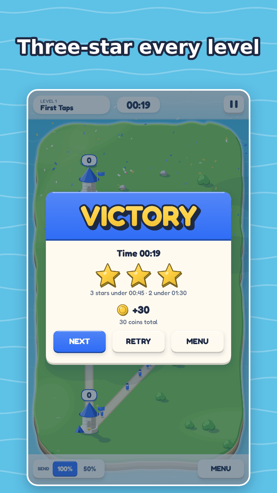
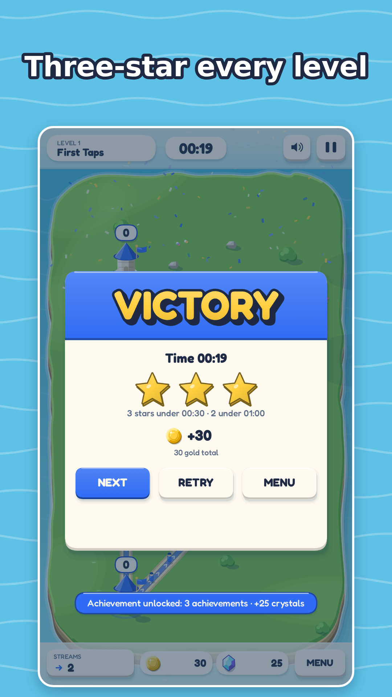

# Tower Clash

**Capture every tower.** A one-thumb, capture-the-towers real-time strategy game for phones and browsers. Tap one of your towers, tap a target, and a stream of soldiers marches until you stop it; towers upgrade themselves as they fill; when an enemy garrison hits zero the tower is yours. 50 hand-made levels, fortresses, artillery, tanks, walls, mines, up to three enemies at once, three-star timers; boosters, Commander upgrades, skins (7 tower roofs, 7 soldier helmets, 3 terrain themes, 4 silhouettes), achievements, a daily reward, a Daily and a Weekly Challenge and a 20-second rewind after a defeat — plays offline, no account. The web version has no ads and nothing to pay for: its shop runs on a demo "Test store" where no money changes hands. The Google Play / App Store apps (in preparation) will offer optional in-app purchases and ads that a one-time purchase removes — see [`../docs/publishing/PRIVACY_POLICY.md`](../docs/publishing/PRIVACY_POLICY.md).

Play in the browser: **https://pervincinal.github.io/InsiderTest/** (active once GitHub Pages is enabled in repo settings — see [`../docs/DEPLOY.md`](../docs/DEPLOY.md))

<p align="center">
  
  
  
  
</p>

## How to play

1. Tap a **blue** tower to select it, then tap any tower it can see in a straight line (thin guide lines show what is reachable; walls, water, rocks and other towers block the line). A **stream** opens: soldiers leave one by one and keep coming until you tap the target again (dragging from tower to tower works too).
2. Friendly towers are reinforced; hostile towers lose one defender per attacker. Reduce a garrison below zero and the tower flips to you — the stream keeps supplying it until you stop it or the tower is full.
3. Towers **upgrade themselves** when they fill: 25 soldiers → level 2, 50 → level 3 (100 max). Higher levels recruit faster and may run more streams — **1 / 2 / 3 streams at level 1 / 2 / 3** (the hint "L2 needed for 2 streams" tells you when you hit the limit). Sending never empties a tower — its soldiers stay home, it only stops growing while it streams; each stream flows at the tower's speed (1 / 1.4 / 2 soldiers per second at level 1 / 2 / 3). Close the stream when you want it to level up.
4. Enemy streams are drawn as straight ribbons in their colour — read them, then answer them: reinforce the threatened tower or hit the attacker's source, which has stopped growing. A tower under attack stops recruiting (its count badge turns peach with a crossed-swords pip), so an unanswered stream eventually takes it.
5. **Fortresses** (level 9 onwards) halve the damage of every attack; **artillery** (level 12 onwards) shoots soldiers that walk into its range.
6. From level 17 you face **two enemies** (three from level 33, and on every one of levels 41–50, the Grand Campaign) who also fight each other; **walls**, rivers and rocks (from level 5) block the line of attack and **mines** kill the first soldiers to pass over them.
7. **Tank factories** (level 25 onwards) build tanks that weigh five soldiers but crawl.
8. Win faster for more stars (3 / 2 / 1). Stars unlock the next level and pay **gold** on the first clear; replays and star improvements pay a little more.
9. Three **boosters** in the bottom bar, paid with gold: Overdrive (×3 production for 10 s), Freeze (enemies stop producing for 5 s), Airstrike (−10 units on one enemy tower).
10. **Daily Challenge** (card at the top of the level map, unlocked after level 8): one fixed level, seed and twist per UTC day for everyone — Plain, Lean (−10 % production), Fast feet (+25 % march speed), Thin walls (−20 % capacity) or Reinforced (+5 soldiers at start). Upgrades and boosters are off, retries are free, and the first win of the day pays 30 + 10 × stars gold and 5 crystals; a streak counts consecutive days won.
11. **Weekly Challenge** (WEEKLY tab on the same card, unlocked after level 32): one fixed level from 33–50 per week, from Monday 00:00 UTC, always with a twist and the same for everyone. Retries are free; the first win of the week pays 100 gold and beating the level's three-star clock pays 20 crystals once; a week streak counts consecutive weeks won.

Keyboard on desktop: `P` / `Space` pause, `Esc` back to the level list, `M` mute.

Menus, hints, the tutorial, level names and lesson lines are in English, Azerbaijani, Russian and Turkish (Settings → Language); every one of the 50 levels carries its name and lesson in all four.

## Between battles

- **Gold and crystals.** Gold comes from stars and replays; crystals from level milestones (every 10 levels), a whole band at three stars, achievements and days 4 and 7 of the daily streak. Crystals convert to gold (1 : 5), never the other way round.
- **Commander upgrades** (shop, Upgrades tab): five permanent tracks bought with gold, five tiers each — production, capacity, starting garrison, booster price, march speed. Capped so every level stays winnable without them.
- **Skins** (shop, Skins tab): 7 tower roofs, 7 soldier helmets, 3 terrain themes (Dusk, Winter night, Neon) and 4 silhouettes (Round keep, Watchtower, Shield bearers, Clockwork robots). Cosmetic only — readability and team colours never change.
- **Achievements** (trophy button): eleven of them with progress bars, each paying crystals.
- **Daily reward** on the title screen: a 7-day streak of gold and crystals.
- **Continue with rewind:** after a defeat, *Reinforcements* (10 crystals) rewinds the battle 20 seconds, adds a free Freeze and +15 soldiers on your strongest tower, and resumes — once per attempt. The clock keeps the original start, so continuing never improves your stars. A *Level skip* is offered after three defeats on the same level.
- **Settings** (gear on the title screen and in the pause menu): sound, colour-blind palette, reduced motion, language (English, Azerbaijani, Russian, Turkish), reset progress. The native apps add *Privacy options* (re-opens the ad consent form where the law requires it) and a *Support ID* under About; neither exists on the web because the web build has no ads and no store SDK.

## Install on a phone (PWA — no store needed)

The web build is an installable Progressive Web App: it works offline and opens fullscreen from the home screen.

- **iPhone / iPad (Safari only):** open the play link → Share → **Add to Home Screen** → Add.
- **Android (Chrome):** open the play link → ⋮ menu → **Install app** (or *Add to Home screen*) → Install.

## Android APK from CI

Every push that touches `tower-clash/` runs the **tower-clash-android** GitHub Actions workflow and attaches an unsigned debug APK.

1. GitHub → **Actions** → **tower-clash-android** → latest green run → **Artifacts** → `tower-clash-debug-apk`.
2. Unzip, copy `app-debug.apk` to the phone, tap it, allow installs from that source, and choose *Install anyway* if Play Protect warns (debug builds are unverified).

Step-by-step details, local Android/iOS builds and what a real store release needs: [`../docs/MOBILE.md`](../docs/MOBILE.md). Store texts, privacy policy, launch checklist and release notes: [`../docs/publishing/`](../docs/publishing/).

## Build from source

Requires Node 22.

```bash
cd tower-clash
npm ci
npm run dev        # http://localhost:5173
npm run build      # production build into dist/
npm run check      # typecheck + lint + unit tests + level validation
npm run playtest   # reference-player bot on every level
npm run e2e        # Playwright smoke test (Chromium)
npm run cap:sync   # copy dist/ into the android/ and ios/ Capacitor projects
```

Store screenshots and the feature graphic are rendered from the real game: `npm run build && node store/tools/renderStoreShots.mjs` (Google Play set) or `--apple` (App Store 6.7" / 6.5" sets); `--all` renders both.

No engine, no art assets: TypeScript, HTML5 Canvas 2D and WebAudio. The simulation (`src/sim/`) is deterministic and DOM-free; rendering, input and AI sit on top of it. Design rules: [`../docs/GDD.md`](../docs/GDD.md).

## Credits and license

Built by an autonomous Claude agent team (producer, engineers, level designer, QA, publisher) with a human stakeholder reading daily reports. Version 1.0.0 — see [`../docs/publishing/RELEASE_NOTES.md`](../docs/publishing/RELEASE_NOTES.md).

License: All rights reserved (placeholder).

---

# Tower Clash (Azərbaycanca)

**Bütün qüllələri tut.** Telefon və brauzer üçün bir barmaqla oynanan qüllə tutma real vaxt strategiya oyunu. Öz qüllənə toxun, hədəfə toxun — əsgər axını sən dayandırana qədər yeriyir; qüllələr dolduqca özləri təkmilləşir; düşmən qarnizonu sıfıra düşəndə qüllə sənindir. 50 əl ilə hazırlanmış səviyyə, qalalar, toplar, tanklar, minalar, sədlər, kəsilə bilən körpülər, eyni anda üçə qədər rəqib, üç ulduzlu vaxt limiti; gücləndiricilər, Komandir təkmilləşdirmələri, görünüşlər (7 qüllə damı, 7 əsgər dəbilqəsi, 3 relyef mövzusu, 4 siluet), nailiyyətlər, gündəlik mükafat, Günlük və Həftəlik Çağırış və məğlubiyyətdən sonra 20 saniyəlik geri sarma — oflayn oynanır, hesabsız. Veb versiyada reklam yoxdur və ödəniləsi heç nə yoxdur: mağazası demo "Test store" üzərində işləyir, pul dəyişmir. Hazırlanan Google Play / App Store tətbiqlərində könüllü tətbiqdaxili alışlar və bir alışla silinən reklamlar olacaq — bax [`../docs/publishing/PRIVACY_POLICY.md`](../docs/publishing/PRIVACY_POLICY.md).

Brauzerdə oyna: **https://pervincinal.github.io/InsiderTest/** (repo parametrlərində GitHub Pages aktivləşdirilən kimi işləyir — bax [`../docs/DEPLOY.md`](../docs/DEPLOY.md))

## Necə oynanır

1. **Mavi** qülləyə toxunub seç, sonra yolla bağlı istənilən qülləyə toxun. **Axın** açılır: əsgərlər bir-bir çıxır və sən hədəfə yenidən toxunana qədər gəlməyə davam edir (qüllədən qülləyə sürükləmək də işləyir).
2. Dost qüllələr güclənir; düşmən qüllələrində hər hücumçu bir müdafiəçini aparır. Qarnizon sıfırın altına düşəndə qüllə sənə keçir — axın sən dayandırana və ya qüllə dolana qədər onu təchiz etməyə davam edir.
3. Qüllələr dolanda **özləri təkmilləşir**: 25 əsgər → 2-ci səviyyə, 50 → 3-cü səviyyə (maksimum 100). Yüksək səviyyə daha sürətli əsgər yığır və daha çox axın apara bilir — **1 / 2 / 3-cü səviyyədə 1 / 2 / 3 axın** (limitə çatanda "2 axın üçün L2 lazımdır" işarəsi çıxır). Axın verən qüllə böyümür, ona görə səviyyəsi qalxsın istəyirsənsə axını bağla.
4. Düşmən axınları yolların üstündə öz rəngində çəkilir — oxu və cavab ver: təhdid altındakı qülləni gücləndir və ya hücumçunun boşalmış mənbəyini vur. Hücum altındakı qüllə əsgər yığmır (say nişanı şaftalı rəngə keçir, üstündə çarpaz qılınc işarəsi), ona görə cavabsız qalan axın onu gec-tez alır.
5. **Qalalar** (9-cu səviyyədən) hər hücumun zərərini yarıya endirir; **toplar** (12-ci səviyyədən) mənzilinə girən əsgərləri vurur.
6. 17-ci səviyyədən **iki rəqib** (33-cü səviyyədən üç, 41–50-ci səviyyələrin — Böyük Kampaniyanın — hər birində üç) — onlar bir-biri ilə də vuruşur; **minalar** yoldan ilk keçən əsgərləri məhv edir, **sədlər** aşındırılmalı və ya yan keçilməlidir.
7. **Tank zavodları** (25-ci səviyyədən) beş əsgər ağırlığında, amma yavaş tanklar istehsal edir; **körpülər** uzun basışla kəsilir — körpüdəki kolon batır, arxadakı düşmən ilişib qalır.
8. Tez qalib gəl — daha çox ulduz (3 / 2 / 1). Ulduzlar növbəti səviyyəni açır və ilk keçiddə **qızıl** qazandırır; təkrar oyunlar və ulduz yaxşılaşdırmaları bir az da verir.
9. Aşağı zolaqda qızılla ödənilən üç **gücləndirici**: Overdrive (10 saniyə ×3 istehsal), Freeze (rəqiblər 5 saniyə istehsal etmir), Airstrike (bir düşmən qülləsindən −10 əsgər).
10. **Gündəlik Çağırış** (səviyyə xəritəsinin başındakı kart, 8-ci səviyyədən sonra açılır): hər UTC günü hamı üçün eyni səviyyə, seed və fənd — Adi, Qənaətli (−10 % istehsal), Cəld ayaq (+25 % yürüş sürəti), Nazik divar (−20 % tutum) və ya Möhkəmləndirilmiş (başlanğıcda +5 əsgər). Təkmilləşdirmələr və gücləndiricilər söndürülür, təkrar cəhdlər pulsuzdur, günün ilk qələbəsi 30 + 10 × ulduz qızıl və 5 kristal verir; seriya ardıcıl qalib günləri sayır.
11. **Həftəlik Çağırış** (eyni kartda HƏFTƏLİK tabı, 32-ci səviyyədən sonra açılır): həftədə bir, bazar ertəsi 00:00 UTC-dən, 33–50 arasından sabit bir səviyyə, həmişə fəndli və hamı üçün eyni. Təkrar cəhdlər pulsuzdur; həftənin ilk qələbəsi 100 qızıl, səviyyənin üç ulduz vaxtını keçmək bir dəfə 20 kristal verir; seriya ardıcıl qalib həftələri sayır.

Masaüstündə klaviatura: `P` / `Space` pauza, `Esc` səviyyə siyahısına, `M` səsi söndürür. Menyular, işarələr, təlimat, səviyyə adları və dərs cümlələri azərbaycanca, ingiliscə, rusca və türkcədir (Parametrlər → Dil); 50 səviyyənin hər birinin adı və dərsi dörd dildədir.

## Döyüşlər arasında

- **Qızıl və kristallar.** Qızıl ulduzlardan və təkrar oyunlardan gəlir; kristallar səviyyə mərhələlərindən (hər 10 səviyyə), bir zonanın hamısını üç ulduzla keçməkdən, nailiyyətlərdən və gündəlik seriyanın 4 və 7-ci günlərindən. Kristal qızıla çevrilir (1 : 5), əksinə heç vaxt.
- **Komandir təkmilləşdirmələri** (mağaza, Təkmilləşdirmələr tabı): qızılla alınan beş daimi xətt, hər biri beş pillə — istehsal, tutum, başlanğıc qarnizon, gücləndirici qiyməti, yürüş sürəti. Elə məhdudlaşdırılıb ki, hər səviyyə onlarsız da keçilə bilsin.
- **Görünüşlər** (mağaza, Görünüşlər tabı): 7 qüllə damı, 7 əsgər dəbilqəsi, 3 relyef mövzusu (Alaqaranlıq, Qış gecəsi, Neon) və 4 siluet (Dairəvi qala, Gözətçi qülləsi, Qalxan daşıyanlar, Mexaniki robotlar). Yalnız kosmetikdir — oxunaqlılıq və komanda rəngləri dəyişmir.
- **Nailiyyətlər** (kubok düyməsi): tərəqqi zolaqlı on bir nailiyyət, hər biri kristal verir.
- **Gündəlik mükafat** baş ekranda: 7 günlük qızıl və kristal seriyası.
- **Geri sarma ilə davam:** məğlubiyyətdən sonra *Əlavə qüvvə* (10 kristal) döyüşü 20 saniyə geriyə sarır, pulsuz Freeze və ən güclü qüllənə +15 əsgər verir və davam edir — hər cəhddə bir dəfə. Saat orijinal başlanğıcı saxlayır, yəni davam etmək ulduzu yaxşılaşdırmır. Eyni səviyyədə üç məğlubiyyətdən sonra *Səviyyəni keçmək* təklif olunur.
- **Parametrlər** (baş ekranda və pauza menyusunda dişli): səs, rəng korluğu palitrası, azaldılmış hərəkət, dil (azərbaycanca, ingiliscə, rusca, türkcə), irəliləyişi sıfırlama. Native tətbiqlər *Məxfilik seçimləri* (qanunun tələb etdiyi yerdə reklam razılıq formasını yenidən açır) və Haqqında bölməsində *Dəstək ID* əlavə edir; vebdə reklam və mağaza SDK-sı olmadığı üçün bunlar yoxdur.

## Telefona quraşdırma (PWA — mağaza lazım deyil)

- **iPhone / iPad (yalnız Safari):** oyun linkini aç → Paylaş → **Ana ekrana əlavə et** → Əlavə et.
- **Android (Chrome):** oyun linkini aç → ⋮ menyu → **Tətbiqi quraşdır** (və ya *Ana ekrana əlavə et*) → Quraşdır.

Quraşdırıldıqdan sonra oyun oflayn işləyir və ana ekrandan tam ekran açılır.

## CI-dan Android APK

Hər push-dan sonra **tower-clash-android** GitHub Actions workflow-u imzasız debug APK hazırlayır: GitHub → **Actions** → **tower-clash-android** → son yaşıl run → **Artifacts** → `tower-clash-debug-apk`. Zipi aç, `app-debug.apk` faylını telefona köçür, üstünə toxun, naməlum mənbədən quraşdırmağa icazə ver; Play Protect xəbərdarlıq etsə *Yenə də quraşdır* seç. Ətraflı: [`../docs/MOBILE.md`](../docs/MOBILE.md).

## Mənbədən qurmaq

Node 22 lazımdır. `tower-clash/` qovluğunda: `npm ci`, sonra `npm run dev` (yerli server), `npm run build` (istehsal build-i `dist/`-ə), `npm run check` (tip yoxlaması + lint + testlər + səviyyə yoxlaması), `npm run playtest` (bot bütün səviyyələri oynayır), `npm run e2e` (Playwright smoke testi).

## Müəlliflər və lisenziya

Avtonom Claude agent komandası tərəfindən hazırlanıb (prodüser, mühəndislər, səviyyə dizayneri, QA, nəşriyyatçı); insan tərəf gündəlik hesabatları oxuyur. Versiya 1.0.0 — bax [`../docs/publishing/RELEASE_NOTES.md`](../docs/publishing/RELEASE_NOTES.md).

Lisenziya: Bütün hüquqlar qorunur (müvəqqəti qeyd).
